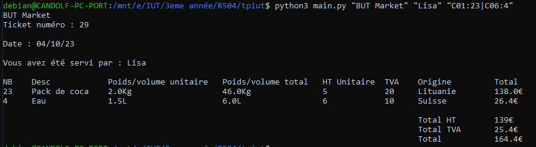

# tpiut
TP sur la gestion de projet niveau IUT

# Description

Ce programme permet de générer un ticket de caisse.
Il effectue les calculs de prix en fonction des variables attribuées.


# Comment utiliser le programme?

Voici comment utiliser 

```
python3 ticket.py <"nom du magasin"> <"Nom du vendeur/se"> <"n°série A:nbr_articles A | n°série B:nbr_articles B">
```

Voici un exemple d'utilisation :

```
Python3 main.py “But Market” “Lisa” “C01:10|C02:2”
```

qui affiche en sortie :



Proxy ferme à 12h30 vu avec le prof.


# Comment est initialisée la base de données


|Code article|Description| Poids ou volume unitaire |Prix HT unitaire| TVA | Origine
| :--------: | :-------: | :--: | :------------: | :--: | :--:
|    C01     |pack de coca  | 2kg  | 5 | 20% |Lituanie
|    C02     |kilo de pdt   | 1kg  | 1 | 10% |Espagne
|    C03     |pack Biscotte | 950g | 2 | 10%|France
|    C04     |Café soluble  | 250g | 3 |10% |Roumanie
|    C05     |Crakers       | 125g | 4 | 20% |Angleterre
|    C06     |Eau           | 1,5L | 6 | 10% |Suisse
|    C07     | Pain         | 250g | 1 | 10% |France

# Comment modifier la base de données

Afin de modifier la base de donnée, il vous faudra ouvrir le fichier main.py
à la 5ème ligne vous trouverez "produit".
Ajoutez en dessous de cette ligne le produit que vous souhaitez en respectant la nomenclature tel que :

```
"Code d'article":[Description, prix, poids, TVA, origine],
```
ATTENTION A NE PAS OUBLIER LA VIRGULE