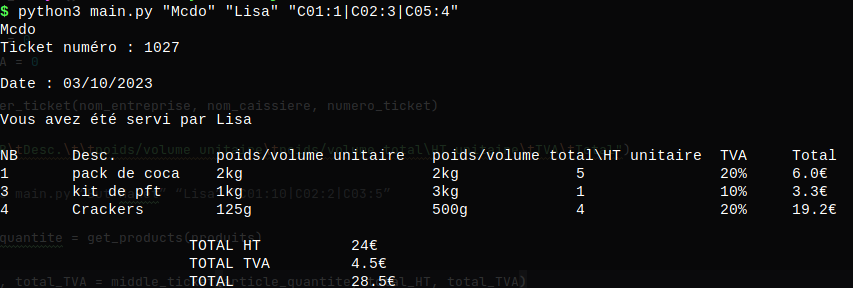
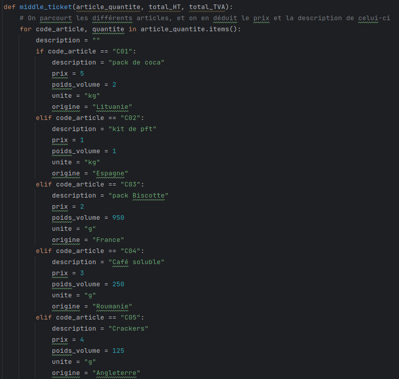

# tpiut
TP sur la gestion de projet niveau IUT

# Récupération du Projet
git clone PROJET

# Code_Article Description              
C01 "pack de coca"
C02 "kilo de pdt"
C03 "pack Biscotte"
C04 "Café soluble"
C05 "Crakers"

# Récupération du Projet
2ème étape : lancer la commande <python3 main.tf "NOM_ENTREPRISE" "NOM_CAISSIER" "C01:4|C02|2">

Dans le 3ème argument, on ajoute autant de article que l'on veut, en les séparant par des '|'.

Dans chaque article, on précise le Code_Article et le Nombre_article avec le ':'

Si je veux 6 pack de coca et 2 Crackers je ferai ceci : "C01:6|C05:2"

# Execution du code


# Changer le prix produit - ajout produit - origine 
Dans la fonction middle_ticket() que l'on peut voir ci-dessous. On a la possibilité modifier le prix correspondant.
Si vous avez besoin d'un nouveau produit, ajouter ceci : 
```py
elif code_article == "CodeArticle":
    description = "Votre description"
    origine = ""
    prix = 100 # changer le prix, si vous le souhaiter
```



# Changer le prix produit - ajout produit
Dans la fonction middle_ticket() que l'on peut voir ci-dessous. On a la possibilité modifier le prix correspondant.
Si vous avez besoin d'un nouveau produit, ajouter ceci : 
```py
elif code_article == "CodeArticle":
    description = "Votre description"
    prix = 100 # changer le prix, si vous le souhaiter
```


